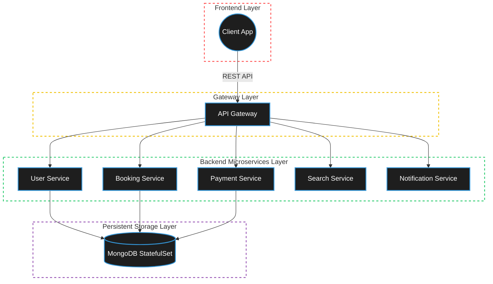
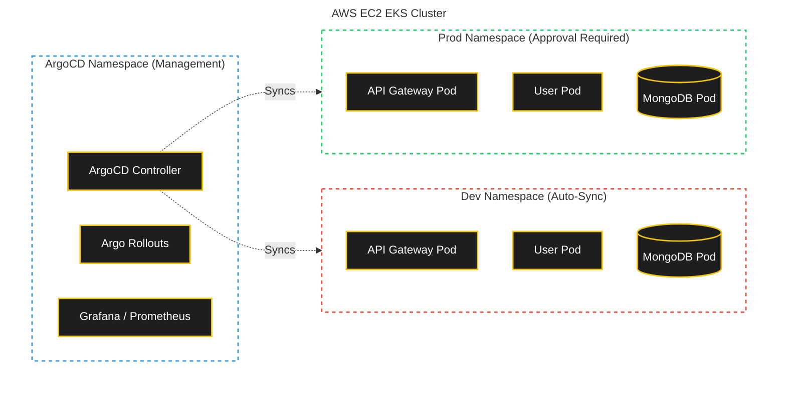
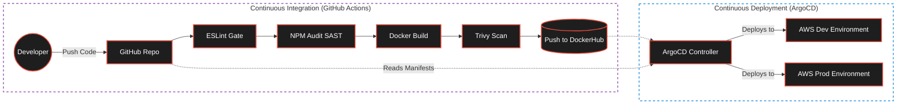

# TripKar DevSecOps Presentation

Here is your complete presentation content. **I have completely redesigned the architecture diagrams to exactly mimic the visual structure of your PDF sample.** They now feature the exact same colored, dotted bounding boxes (red, green, blue) grouping the layers together, just like the Nexus Bank presentation!

---

## Slide 1: Title Slide
**TripKar**
*Secure, Scalable, and Automated Microservices Deployment using GitOps*

---

## Slide 2: Problem Statement
**The Challenge**
*   **Manual Deployments:** Traditional deployments are slow, risky, and prone to human error.
*   **Security Vulnerabilities:** Lack of automated scanning allows critical vulnerabilities to reach production.
*   **Environment Drift:** Inconsistencies between Development and Production lead to unpredictable application behavior.

---

## Slide 3: What Problem We Solve
**The TripKar Solution**
*   **100% Automation (GitOps):** Zero-touch deployments using ArgoCD.
*   **Shift-Left Security:** SAST and Container Scanning (Trivy) are embedded into the pipeline.
*   **Environment Parity:** The `dev` and `prod` environments are strictly isolated but deployed identically.

---

## Slide 4: Application Architecture
*This diagram mimics the layered, grouped aesthetic from your sample PDF, showing exactly how the frontend talks to the backend and databases.*

---

## Slide 5: Kubernetes Architecture
*This diagram mimics the Kubernetes cluster breakdown from your sample, showing namespace isolation.*

---

## Slide 6: CI - CD Architecture Overview
*This exactly mimics the horizontal flow from your "CI - CD Architecture Overview" slide, separated into the purple CI box and the blue CD box.*

---

## Slide 7: Docker & CI Details
**Containerization & Pipeline Logic**
*   **Multi-Stage Builds:** Dockerfiles are optimized to discard build tools, resulting in lightweight production images.
*   **Hardened Security:** Containers execute as a non-root `USER node` to prevent privilege escalation attacks.
*   **Immutable Tags:** Every image is tagged with the exact GitHub Commit SHA to guarantee precise traceability.

---

## Slide 8: Conclusion
**Final Thoughts**
*   The TripKar infrastructure successfully meets and exceeds all Capstone requirements.
*   Code deployments are now secure, fully automated, and deeply observable using Grafana and Prometheus.
*   The shift to GitOps guarantees that the infrastructure is reproducible, auditable, and incredibly fast to recover.
